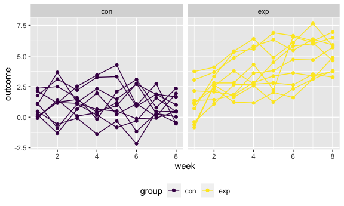
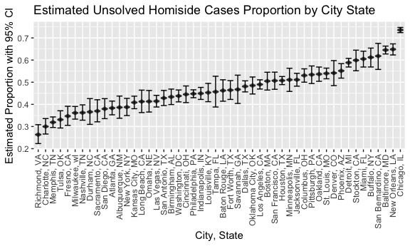
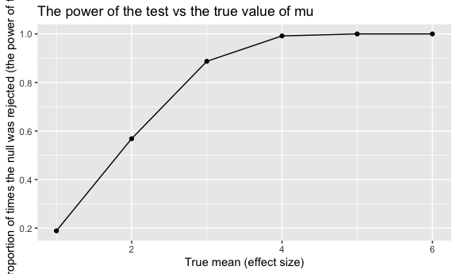
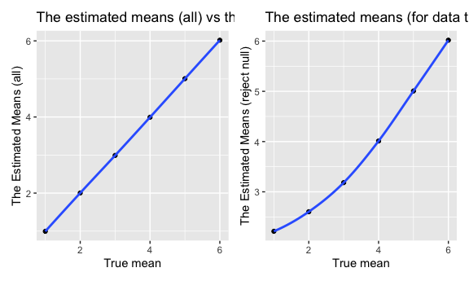

p8105_hw5_pl2848
================
Pei Liu
2022-11-10

## Problem 1

The code chunk below imports the data in individual spreadsheets
contained in `./data/zip_data/`. To do this, I create a dataframe that
includes the list of all files in that directory and the complete path
to each file. As a next step, I `map` over paths and import data using
the `read_csv` function. Finally, I `unnest` the result of `map`.

``` r
full_df = 
  tibble(
    files = list.files("data"),
    path = str_c("data/", files)
  ) %>% 
  mutate(data = map(path, read_csv)) %>% 
  unnest(data)
```

    ## Rows: 1 Columns: 8
    ## ── Column specification ────────────────────────────────────────────────────────
    ## Delimiter: ","
    ## dbl (8): week_1, week_2, week_3, week_4, week_5, week_6, week_7, week_8
    ## 
    ## ℹ Use `spec()` to retrieve the full column specification for this data.
    ## ℹ Specify the column types or set `show_col_types = FALSE` to quiet this message.
    ## Rows: 1 Columns: 8
    ## ── Column specification ────────────────────────────────────────────────────────
    ## Delimiter: ","
    ## dbl (8): week_1, week_2, week_3, week_4, week_5, week_6, week_7, week_8
    ## 
    ## ℹ Use `spec()` to retrieve the full column specification for this data.
    ## ℹ Specify the column types or set `show_col_types = FALSE` to quiet this message.
    ## Rows: 1 Columns: 8
    ## ── Column specification ────────────────────────────────────────────────────────
    ## Delimiter: ","
    ## dbl (8): week_1, week_2, week_3, week_4, week_5, week_6, week_7, week_8
    ## 
    ## ℹ Use `spec()` to retrieve the full column specification for this data.
    ## ℹ Specify the column types or set `show_col_types = FALSE` to quiet this message.
    ## Rows: 1 Columns: 8
    ## ── Column specification ────────────────────────────────────────────────────────
    ## Delimiter: ","
    ## dbl (8): week_1, week_2, week_3, week_4, week_5, week_6, week_7, week_8
    ## 
    ## ℹ Use `spec()` to retrieve the full column specification for this data.
    ## ℹ Specify the column types or set `show_col_types = FALSE` to quiet this message.
    ## Rows: 1 Columns: 8
    ## ── Column specification ────────────────────────────────────────────────────────
    ## Delimiter: ","
    ## dbl (8): week_1, week_2, week_3, week_4, week_5, week_6, week_7, week_8
    ## 
    ## ℹ Use `spec()` to retrieve the full column specification for this data.
    ## ℹ Specify the column types or set `show_col_types = FALSE` to quiet this message.
    ## Rows: 1 Columns: 8
    ## ── Column specification ────────────────────────────────────────────────────────
    ## Delimiter: ","
    ## dbl (8): week_1, week_2, week_3, week_4, week_5, week_6, week_7, week_8
    ## 
    ## ℹ Use `spec()` to retrieve the full column specification for this data.
    ## ℹ Specify the column types or set `show_col_types = FALSE` to quiet this message.
    ## Rows: 1 Columns: 8
    ## ── Column specification ────────────────────────────────────────────────────────
    ## Delimiter: ","
    ## dbl (8): week_1, week_2, week_3, week_4, week_5, week_6, week_7, week_8
    ## 
    ## ℹ Use `spec()` to retrieve the full column specification for this data.
    ## ℹ Specify the column types or set `show_col_types = FALSE` to quiet this message.
    ## Rows: 1 Columns: 8
    ## ── Column specification ────────────────────────────────────────────────────────
    ## Delimiter: ","
    ## dbl (8): week_1, week_2, week_3, week_4, week_5, week_6, week_7, week_8
    ## 
    ## ℹ Use `spec()` to retrieve the full column specification for this data.
    ## ℹ Specify the column types or set `show_col_types = FALSE` to quiet this message.
    ## Rows: 1 Columns: 8
    ## ── Column specification ────────────────────────────────────────────────────────
    ## Delimiter: ","
    ## dbl (8): week_1, week_2, week_3, week_4, week_5, week_6, week_7, week_8
    ## 
    ## ℹ Use `spec()` to retrieve the full column specification for this data.
    ## ℹ Specify the column types or set `show_col_types = FALSE` to quiet this message.
    ## Rows: 1 Columns: 8
    ## ── Column specification ────────────────────────────────────────────────────────
    ## Delimiter: ","
    ## dbl (8): week_1, week_2, week_3, week_4, week_5, week_6, week_7, week_8
    ## 
    ## ℹ Use `spec()` to retrieve the full column specification for this data.
    ## ℹ Specify the column types or set `show_col_types = FALSE` to quiet this message.
    ## Rows: 1 Columns: 8
    ## ── Column specification ────────────────────────────────────────────────────────
    ## Delimiter: ","
    ## dbl (8): week_1, week_2, week_3, week_4, week_5, week_6, week_7, week_8
    ## 
    ## ℹ Use `spec()` to retrieve the full column specification for this data.
    ## ℹ Specify the column types or set `show_col_types = FALSE` to quiet this message.
    ## Rows: 1 Columns: 8
    ## ── Column specification ────────────────────────────────────────────────────────
    ## Delimiter: ","
    ## dbl (8): week_1, week_2, week_3, week_4, week_5, week_6, week_7, week_8
    ## 
    ## ℹ Use `spec()` to retrieve the full column specification for this data.
    ## ℹ Specify the column types or set `show_col_types = FALSE` to quiet this message.
    ## Rows: 1 Columns: 8
    ## ── Column specification ────────────────────────────────────────────────────────
    ## Delimiter: ","
    ## dbl (8): week_1, week_2, week_3, week_4, week_5, week_6, week_7, week_8
    ## 
    ## ℹ Use `spec()` to retrieve the full column specification for this data.
    ## ℹ Specify the column types or set `show_col_types = FALSE` to quiet this message.
    ## Rows: 1 Columns: 8
    ## ── Column specification ────────────────────────────────────────────────────────
    ## Delimiter: ","
    ## dbl (8): week_1, week_2, week_3, week_4, week_5, week_6, week_7, week_8
    ## 
    ## ℹ Use `spec()` to retrieve the full column specification for this data.
    ## ℹ Specify the column types or set `show_col_types = FALSE` to quiet this message.
    ## Rows: 1 Columns: 8
    ## ── Column specification ────────────────────────────────────────────────────────
    ## Delimiter: ","
    ## dbl (8): week_1, week_2, week_3, week_4, week_5, week_6, week_7, week_8
    ## 
    ## ℹ Use `spec()` to retrieve the full column specification for this data.
    ## ℹ Specify the column types or set `show_col_types = FALSE` to quiet this message.
    ## Rows: 1 Columns: 8
    ## ── Column specification ────────────────────────────────────────────────────────
    ## Delimiter: ","
    ## dbl (8): week_1, week_2, week_3, week_4, week_5, week_6, week_7, week_8
    ## 
    ## ℹ Use `spec()` to retrieve the full column specification for this data.
    ## ℹ Specify the column types or set `show_col_types = FALSE` to quiet this message.
    ## Rows: 1 Columns: 8
    ## ── Column specification ────────────────────────────────────────────────────────
    ## Delimiter: ","
    ## dbl (8): week_1, week_2, week_3, week_4, week_5, week_6, week_7, week_8
    ## 
    ## ℹ Use `spec()` to retrieve the full column specification for this data.
    ## ℹ Specify the column types or set `show_col_types = FALSE` to quiet this message.
    ## Rows: 1 Columns: 8
    ## ── Column specification ────────────────────────────────────────────────────────
    ## Delimiter: ","
    ## dbl (8): week_1, week_2, week_3, week_4, week_5, week_6, week_7, week_8
    ## 
    ## ℹ Use `spec()` to retrieve the full column specification for this data.
    ## ℹ Specify the column types or set `show_col_types = FALSE` to quiet this message.
    ## Rows: 1 Columns: 8
    ## ── Column specification ────────────────────────────────────────────────────────
    ## Delimiter: ","
    ## dbl (8): week_1, week_2, week_3, week_4, week_5, week_6, week_7, week_8
    ## 
    ## ℹ Use `spec()` to retrieve the full column specification for this data.
    ## ℹ Specify the column types or set `show_col_types = FALSE` to quiet this message.
    ## Rows: 1 Columns: 8
    ## ── Column specification ────────────────────────────────────────────────────────
    ## Delimiter: ","
    ## dbl (8): week_1, week_2, week_3, week_4, week_5, week_6, week_7, week_8
    ## 
    ## ℹ Use `spec()` to retrieve the full column specification for this data.
    ## ℹ Specify the column types or set `show_col_types = FALSE` to quiet this message.

``` r
full_df
```

    ## # A tibble: 20 × 10
    ##    files      path       week_1 week_2 week_3 week_4 week_5 week_6 week_7 week_8
    ##    <chr>      <chr>       <dbl>  <dbl>  <dbl>  <dbl>  <dbl>  <dbl>  <dbl>  <dbl>
    ##  1 con_01.csv data/con_…   0.2   -1.31   0.66   1.96   0.23   1.09   0.05   1.94
    ##  2 con_02.csv data/con_…   1.13  -0.88   1.07   0.17  -0.83  -0.31   1.58   0.44
    ##  3 con_03.csv data/con_…   1.77   3.11   2.22   3.26   3.31   0.89   1.88   1.01
    ##  4 con_04.csv data/con_…   1.04   3.66   1.22   2.33   1.47   2.7    1.87   1.66
    ##  5 con_05.csv data/con_…   0.47  -0.58  -0.09  -1.37  -0.32  -2.17   0.45   0.48
    ##  6 con_06.csv data/con_…   2.37   2.5    1.59  -0.16   2.08   3.07   0.78   2.35
    ##  7 con_07.csv data/con_…   0.03   1.21   1.13   0.64   0.49  -0.12  -0.07   0.46
    ##  8 con_08.csv data/con_…  -0.08   1.42   0.09   0.36   1.18  -1.16   0.33  -0.44
    ##  9 con_09.csv data/con_…   0.08   1.24   1.44   0.41   0.95   2.75   0.3    0.03
    ## 10 con_10.csv data/con_…   2.14   1.15   2.52   3.44   4.26   0.97   2.73  -0.53
    ## 11 exp_01.csv data/exp_…   3.05   3.67   4.84   5.8    6.33   5.46   6.38   5.91
    ## 12 exp_02.csv data/exp_…  -0.84   2.63   1.64   2.58   1.24   2.32   3.11   3.78
    ## 13 exp_03.csv data/exp_…   2.15   2.08   1.82   2.84   3.36   3.61   3.37   3.74
    ## 14 exp_04.csv data/exp_…  -0.62   2.54   3.78   2.73   4.49   5.82   6      6.49
    ## 15 exp_05.csv data/exp_…   0.7    3.33   5.34   5.57   6.9    6.66   6.24   6.95
    ## 16 exp_06.csv data/exp_…   3.73   4.08   5.4    6.41   4.87   6.09   7.66   5.83
    ## 17 exp_07.csv data/exp_…   1.18   2.35   1.23   1.17   2.02   1.61   3.13   4.88
    ## 18 exp_08.csv data/exp_…   1.37   1.43   1.84   3.6    3.8    4.72   4.68   5.7 
    ## 19 exp_09.csv data/exp_…  -0.4    1.08   2.66   2.7    2.8    2.64   3.51   3.27
    ## 20 exp_10.csv data/exp_…   1.09   2.8    2.8    4.3    2.25   6.57   6.09   4.64

The result of the previous code chunk isn’t tidy – data are wide rather
than long, and some important variables are included as parts of others.
The code chunk below tides the data using string manipulations on the
file, converting from wide to long, and selecting relevant variables.

``` r
tidy_df = 
  full_df %>% 
  mutate(
    files = str_replace(files, ".csv", ""),
    group = str_sub(files, 1, 3)) %>% 
  pivot_longer(
    week_1:week_8,
    names_to = "week",
    values_to = "outcome",
    names_prefix = "week_") %>% 
  mutate(week = as.numeric(week)) %>% 
  select(group, subj = files, week, outcome)

tidy_df
```

    ## # A tibble: 160 × 4
    ##    group subj    week outcome
    ##    <chr> <chr>  <dbl>   <dbl>
    ##  1 con   con_01     1    0.2 
    ##  2 con   con_01     2   -1.31
    ##  3 con   con_01     3    0.66
    ##  4 con   con_01     4    1.96
    ##  5 con   con_01     5    0.23
    ##  6 con   con_01     6    1.09
    ##  7 con   con_01     7    0.05
    ##  8 con   con_01     8    1.94
    ##  9 con   con_02     1    1.13
    ## 10 con   con_02     2   -0.88
    ## # … with 150 more rows

Finally, the code chunk below creates a plot showing individual data,
faceted by group.

``` r
tidy_df %>% 
  ggplot(aes(x = week, y = outcome, group = subj, color = group)) + 
  geom_point() + 
  geom_path() + 
  facet_grid(~group)
```



This plot suggests high within-subject correlation – subjects who start
above average end up above average, and those that start below average
end up below average. Subjects in the control group generally don’t
change over time, but those in the experiment group increase their
outcome in a roughly linear way.

## Problem 2

Describe the raw data.

-   There are 52179 observations and 12 variables in the raw data. Key
    variables includes: uid, reported_data, victim_last, victim_first,
    victim_race, victim_age,victim_sex, city, state, lat, lon and
    disposition. Disposition records the status of homicide cases.

``` r
# read the file and add new column city_state
homicide = read_csv("data-homicides-master/homicide-data.csv") 
```

    ## Rows: 52179 Columns: 12
    ## ── Column specification ────────────────────────────────────────────────────────
    ## Delimiter: ","
    ## chr (9): uid, victim_last, victim_first, victim_race, victim_age, victim_sex...
    ## dbl (3): reported_date, lat, lon
    ## 
    ## ℹ Use `spec()` to retrieve the full column specification for this data.
    ## ℹ Specify the column types or set `show_col_types = FALSE` to quiet this message.

``` r
homicide
```

    ## # A tibble: 52,179 × 12
    ##    uid   repor…¹ victi…² victi…³ victi…⁴ victi…⁵ victi…⁶ city  state   lat   lon
    ##    <chr>   <dbl> <chr>   <chr>   <chr>   <chr>   <chr>   <chr> <chr> <dbl> <dbl>
    ##  1 Alb-…  2.01e7 GARCIA  JUAN    Hispan… 78      Male    Albu… NM     35.1 -107.
    ##  2 Alb-…  2.01e7 MONTOYA CAMERON Hispan… 17      Male    Albu… NM     35.1 -107.
    ##  3 Alb-…  2.01e7 SATTER… VIVIANA White   15      Female  Albu… NM     35.1 -107.
    ##  4 Alb-…  2.01e7 MENDIO… CARLOS  Hispan… 32      Male    Albu… NM     35.1 -107.
    ##  5 Alb-…  2.01e7 MULA    VIVIAN  White   72      Female  Albu… NM     35.1 -107.
    ##  6 Alb-…  2.01e7 BOOK    GERALD… White   91      Female  Albu… NM     35.2 -107.
    ##  7 Alb-…  2.01e7 MALDON… DAVID   Hispan… 52      Male    Albu… NM     35.1 -107.
    ##  8 Alb-…  2.01e7 MALDON… CONNIE  Hispan… 52      Female  Albu… NM     35.1 -107.
    ##  9 Alb-…  2.01e7 MARTIN… GUSTAVO White   56      Male    Albu… NM     35.1 -107.
    ## 10 Alb-…  2.01e7 HERRERA ISRAEL  Hispan… 43      Male    Albu… NM     35.1 -107.
    ## # … with 52,169 more rows, 1 more variable: disposition <chr>, and abbreviated
    ## #   variable names ¹​reported_date, ²​victim_last, ³​victim_first, ⁴​victim_race,
    ## #   ⁵​victim_age, ⁶​victim_sex

Create a city_state variable (e.g. “Baltimore, MD”) and then summarize
within cities to obtain the total number of homicides and the number of
unsolved homicides (those for which the disposition is “Closed without
arrest” or “Open/No arrest”).

``` r
# a function to determine whether the case was solved or not
solved_or_not = function(x){
  if(x == "Closed by arrest") {"solved"}
  else "unsolved"
}

# Added a new column to see if the case was solved or unsolved
homicide_by_city = homicide %>% 
  mutate(city_state = paste(city, state, sep =", "),
         status = as.character(map(disposition, solved_or_not))) %>% 
  group_by(status, city_state) %>% 
  summarise(number_of_homicides = n()) %>% 
  pivot_wider(names_from = status,
              values_from = number_of_homicides) 
```

    ## `summarise()` has grouped output by 'status'. You can override using the
    ## `.groups` argument.

``` r
homicide_by_city_total = homicide %>% 
  mutate(city_state = paste(city, state, sep =", "),
         status = as.character(map(disposition, solved_or_not))) %>% 
  group_by(city_state) %>% 
  summarise(number_of_homicides = n()) 
  
homicide_df = full_join(homicide_by_city,homicide_by_city_total)  %>% 
  drop_na()
```

    ## Joining, by = "city_state"

``` r
homicide_df %>% 
  knitr::kable()
```

| city_state         | solved | unsolved | number_of_homicides |
|:-------------------|-------:|---------:|--------------------:|
| Albuquerque, NM    |    232 |      146 |                 378 |
| Atlanta, GA        |    600 |      373 |                 973 |
| Baltimore, MD      |   1002 |     1825 |                2827 |
| Baton Rouge, LA    |    228 |      196 |                 424 |
| Birmingham, AL     |    453 |      347 |                 800 |
| Boston, MA         |    304 |      310 |                 614 |
| Buffalo, NY        |    202 |      319 |                 521 |
| Charlotte, NC      |    481 |      206 |                 687 |
| Chicago, IL        |   1462 |     4073 |                5535 |
| Cincinnati, OH     |    385 |      309 |                 694 |
| Columbus, OH       |    509 |      575 |                1084 |
| Dallas, TX         |    813 |      754 |                1567 |
| Denver, CO         |    143 |      169 |                 312 |
| Detroit, MI        |   1037 |     1482 |                2519 |
| Durham, NC         |    175 |      101 |                 276 |
| Fort Worth, TX     |    294 |      255 |                 549 |
| Fresno, CA         |    318 |      169 |                 487 |
| Houston, TX        |   1449 |     1493 |                2942 |
| Indianapolis, IN   |    728 |      594 |                1322 |
| Jacksonville, FL   |    571 |      597 |                1168 |
| Kansas City, MO    |    704 |      486 |                1190 |
| Las Vegas, NV      |    809 |      572 |                1381 |
| Long Beach, CA     |    222 |      156 |                 378 |
| Los Angeles, CA    |   1151 |     1106 |                2257 |
| Louisville, KY     |    315 |      261 |                 576 |
| Memphis, TN        |   1031 |      483 |                1514 |
| Miami, FL          |    294 |      450 |                 744 |
| Milwaukee, wI      |    712 |      403 |                1115 |
| Minneapolis, MN    |    179 |      187 |                 366 |
| Nashville, TN      |    489 |      278 |                 767 |
| New Orleans, LA    |    504 |      930 |                1434 |
| New York, NY       |    384 |      243 |                 627 |
| Oakland, CA        |    439 |      508 |                 947 |
| Oklahoma City, OK  |    346 |      326 |                 672 |
| Omaha, NE          |    240 |      169 |                 409 |
| Philadelphia, PA   |   1677 |     1360 |                3037 |
| Phoenix, AZ        |    410 |      504 |                 914 |
| Pittsburgh, PA     |    294 |      337 |                 631 |
| Richmond, VA       |    316 |      113 |                 429 |
| Sacramento, CA     |    237 |      139 |                 376 |
| San Antonio, TX    |    476 |      357 |                 833 |
| San Bernardino, CA |    105 |      170 |                 275 |
| San Diego, CA      |    286 |      175 |                 461 |
| San Francisco, CA  |    327 |      336 |                 663 |
| Savannah, GA       |    131 |      115 |                 246 |
| St. Louis, MO      |    772 |      905 |                1677 |
| Stockton, CA       |    178 |      266 |                 444 |
| Tampa, FL          |    113 |       95 |                 208 |
| Tulsa, OK          |    390 |      193 |                 583 |
| Washington, DC     |    756 |      589 |                1345 |

save the output of prop.test as an R object, apply the broom::tidy to
this object and pull the estimated proportion and confidence intervals
from the resulting tidy dataframe.

``` r
BMD_unsolved_test = prop.test(1825, 2827, p = NULL,alternative = "two.sided",conf.level = 0.95, correct = TRUE) %>% 
  broom::tidy() %>% 
  select(estimate, conf.low, conf.high)

BMD_unsolved_test
```

    ## # A tibble: 1 × 3
    ##   estimate conf.low conf.high
    ##      <dbl>    <dbl>     <dbl>
    ## 1    0.646    0.628     0.663

Now run prop.test for each of the cities in your dataset, and extract
both the proportion of unsolved homicides and the confidence interval
for each.

``` r
city_prop_test = function(x,y){
  test_data = prop.test(x, y, p = NULL,conf.level = 0.95, correct = TRUE) %>%
    broom::tidy()
}

homicide_prop_test = 
tibble(
  city_state = homicide_df$city_state,
  test_result = purrr::map2(homicide_df$unsolved,homicide_df$number_of_homicides, city_prop_test)) %>% 
  unnest(cols = c(test_result)) %>% 
  select(c(city_state, estimate, conf.low, conf.high))

homicide_prop_test %>% 
  knitr::kable()
```

| city_state         |  estimate |  conf.low | conf.high |
|:-------------------|----------:|----------:|----------:|
| Albuquerque, NM    | 0.3862434 | 0.3372604 | 0.4375766 |
| Atlanta, GA        | 0.3833505 | 0.3528119 | 0.4148219 |
| Baltimore, MD      | 0.6455607 | 0.6275625 | 0.6631599 |
| Baton Rouge, LA    | 0.4622642 | 0.4141987 | 0.5110240 |
| Birmingham, AL     | 0.4337500 | 0.3991889 | 0.4689557 |
| Boston, MA         | 0.5048860 | 0.4646219 | 0.5450881 |
| Buffalo, NY        | 0.6122841 | 0.5687990 | 0.6540879 |
| Charlotte, NC      | 0.2998544 | 0.2660820 | 0.3358999 |
| Chicago, IL        | 0.7358627 | 0.7239959 | 0.7473998 |
| Cincinnati, OH     | 0.4452450 | 0.4079606 | 0.4831439 |
| Columbus, OH       | 0.5304428 | 0.5002167 | 0.5604506 |
| Dallas, TX         | 0.4811742 | 0.4561942 | 0.5062475 |
| Denver, CO         | 0.5416667 | 0.4846098 | 0.5976807 |
| Detroit, MI        | 0.5883287 | 0.5687903 | 0.6075953 |
| Durham, NC         | 0.3659420 | 0.3095874 | 0.4260936 |
| Fort Worth, TX     | 0.4644809 | 0.4222542 | 0.5072119 |
| Fresno, CA         | 0.3470226 | 0.3051013 | 0.3913963 |
| Houston, TX        | 0.5074779 | 0.4892447 | 0.5256914 |
| Indianapolis, IN   | 0.4493192 | 0.4223156 | 0.4766207 |
| Jacksonville, FL   | 0.5111301 | 0.4820460 | 0.5401402 |
| Kansas City, MO    | 0.4084034 | 0.3803996 | 0.4370054 |
| Las Vegas, NV      | 0.4141926 | 0.3881284 | 0.4407395 |
| Long Beach, CA     | 0.4126984 | 0.3629026 | 0.4642973 |
| Los Angeles, CA    | 0.4900310 | 0.4692208 | 0.5108754 |
| Louisville, KY     | 0.4531250 | 0.4120609 | 0.4948235 |
| Memphis, TN        | 0.3190225 | 0.2957047 | 0.3432691 |
| Miami, FL          | 0.6048387 | 0.5685783 | 0.6400015 |
| Milwaukee, wI      | 0.3614350 | 0.3333172 | 0.3905194 |
| Minneapolis, MN    | 0.5109290 | 0.4585150 | 0.5631099 |
| Nashville, TN      | 0.3624511 | 0.3285592 | 0.3977401 |
| New Orleans, LA    | 0.6485356 | 0.6231048 | 0.6731615 |
| New York, NY       | 0.3875598 | 0.3494421 | 0.4270755 |
| Oakland, CA        | 0.5364308 | 0.5040588 | 0.5685037 |
| Oklahoma City, OK  | 0.4851190 | 0.4467861 | 0.5236245 |
| Omaha, NE          | 0.4132029 | 0.3653146 | 0.4627477 |
| Philadelphia, PA   | 0.4478103 | 0.4300380 | 0.4657157 |
| Phoenix, AZ        | 0.5514223 | 0.5184825 | 0.5839244 |
| Pittsburgh, PA     | 0.5340729 | 0.4942706 | 0.5734545 |
| Richmond, VA       | 0.2634033 | 0.2228571 | 0.3082658 |
| Sacramento, CA     | 0.3696809 | 0.3211559 | 0.4209131 |
| San Antonio, TX    | 0.4285714 | 0.3947772 | 0.4630331 |
| San Bernardino, CA | 0.6181818 | 0.5576628 | 0.6753422 |
| San Diego, CA      | 0.3796095 | 0.3354259 | 0.4258315 |
| San Francisco, CA  | 0.5067873 | 0.4680516 | 0.5454433 |
| Savannah, GA       | 0.4674797 | 0.4041252 | 0.5318665 |
| St. Louis, MO      | 0.5396541 | 0.5154369 | 0.5636879 |
| Stockton, CA       | 0.5990991 | 0.5517145 | 0.6447418 |
| Tampa, FL          | 0.4567308 | 0.3881009 | 0.5269851 |
| Tulsa, OK          | 0.3310463 | 0.2932349 | 0.3711192 |
| Washington, DC     | 0.4379182 | 0.4112495 | 0.4649455 |

Create a plot that shows the estimates and CIs for each city – check out
geom_errorbar for a way to add error bars based on the upper and lower
limits. Organize cities according to the proportion of unsolved
homicides.

``` r
homicide_prop_test %>% 
  mutate(city_state = forcats::fct_reorder(city_state, estimate)) %>% 
  ggplot(aes(x = city_state, y = estimate))+ 
  geom_point(alpha = .5) +
  geom_boxplot() + 
  geom_errorbar(aes(ymin = conf.low, ymax = conf.high), width = 0.8) +
  labs(
    title = "Estimated Unsolved Homiside Cases Proportion by City State",
    x = "City, State",
    y = "Estimated Proportion with 95% CI",
  ) +
  theme(legend.position = "bottom",
        axis.text.x = element_text(angle = 90, vjust = 0.5, hjust=1)) 
```



## Problem 3

Set mu=0. Generate 5000 datasets from the model x \~Normal(mu, sigma).

For each dataset, save estimated mean and the p-value arising from a
test of H: mu=0 using a=0.05.

``` r
simulations = function( z, n=30, sigma = 5) {
  
  sim_data = tibble(
    x = rnorm(n , mean = z , sd = sigma),
  )
  
    t.test(sim_data, alternative = "two.sided",mu = 0, conf.level = 0.95) %>%
    broom::tidy() %>%
    select(estimate,p.value)
}


sim_0 = 
  expand_grid(
    mean = 0,
    iter = 1:5000
  ) %>% 
  mutate(
    estimate_df = purrr::map(mean, simulations)
  ) %>% 
  unnest(estimate_df)
```

Repeat the above for μ={1,2,3,4,5,6}, and complete the following:

``` r
sim_results_df = 
  expand_grid(
    mean = c(1,2,3,4,5,6),
    iter = 1:5000
  ) %>% 
  mutate(
    estimate_df = purrr::map(mean, simulations)
  ) %>% 
  unnest(estimate_df)
```

Make a plot showing the proportion of times the null was rejected (the
power of the test) on the y axis and the true value of μ on the x axis.
Describe the association between effect size and power. - When the
effect size increases, the power of the test increases, given a fixed
a. - The slope first increse steadly and then increase slowly until
nearly zero.

``` r
null_rej_plot = sim_results_df %>% 
  group_by(mean) %>% 
  summarise(rej_prop = sum(p.value < 0.05 )/5000) %>% 
  ggplot(aes(x = mean, y = rej_prop)) +
  geom_point() +
  labs(
    title = "The power of the test vs the true value of mu",
    x = "True mean (effect size)",
    y = "The proportion of times the null was rejected (the power of the test)",
  ) +
  geom_line()
  
  
  
ggsave("Null rejection proportion.png", null_rej_plot, width = 8, height = 5) 
null_rej_plot
```



Make a plot showing the average estimate of meanon the y axis and the
true value of mu on the x axis. Make a second plot (or overlay on the
first) the average estimate of means only in samples for which the null
was rejected on the y axis and the true value of mu on the x axis. Is
the sample average of means across tests for which the null is rejected
approximately equal to the true value of mu? Why or why not?

-   The sample average of means for true mean = 4, 5, 6 for which the
    null is rejected approximately equal to the true value of mu, while
    the sample average for true mean = 1, 2, 3 were more deviated from
    the true mean.
-   I think this is related to the power of the test. As the effect size
    increases, the power of the test increases. The power of test is
    increases and is close to 1 when the effect size is equal and larger
    than 4, so the average estimated means would be more and more closer
    to the true mean as the effect size increases.

``` r
library(patchwork)

mean_esti_plot = sim_results_df %>% 
  group_by(mean) %>% 
  summarise(mean_estimate = mean(estimate)) %>% 
  ggplot(aes(x = mean, y = mean_estimate)) +
  geom_point() +
  labs(
    title = "The estimated means (all) vs the true means",
    x = "True mean",
    y = "The Estimated Means (all)",
  ) +
  geom_smooth()
  
mean_esti_null_plot  = sim_results_df %>% 
  filter(p.value < 0.05) %>% 
  group_by(mean) %>% 
  summarise(mean_estimate = mean(estimate)) %>% 
  ggplot(aes(x = mean, y = mean_estimate)) +
  geom_point() +
  labs(
    title = "The estimated means (for data that reject null) vs the true means",
    x = "True mean",
    y = "The Estimated Means (reject null)",
  ) +
  geom_smooth()
  


plot_mean = mean_esti_plot + mean_esti_null_plot
plot_mean
```

    ## `geom_smooth()` using method = 'loess' and formula 'y ~ x'
    ## `geom_smooth()` using method = 'loess' and formula 'y ~ x'



``` r
ggsave("estimated mean vs mu plot.png", plot_mean, width = 8, height = 5) 
```

    ## `geom_smooth()` using method = 'loess' and formula 'y ~ x'
    ## `geom_smooth()` using method = 'loess' and formula 'y ~ x'
